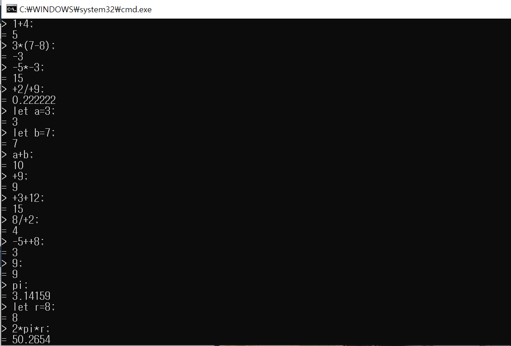
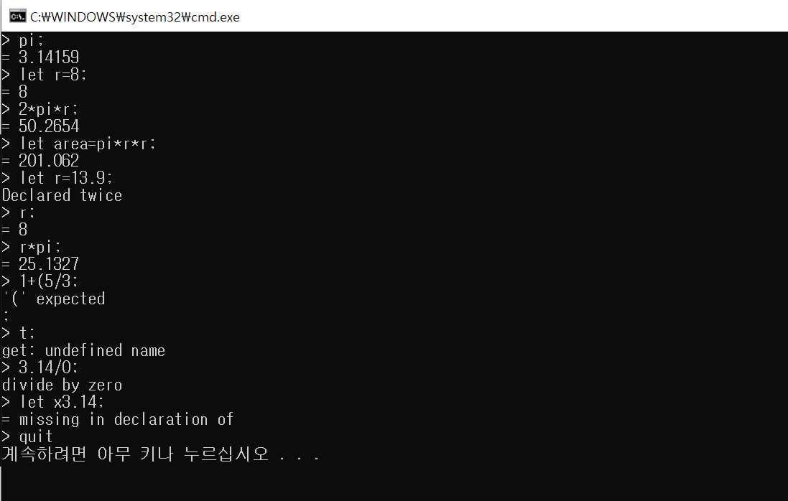

# Calculator (계산기)

## Function
1. Four fundamental rules of arithmetics  **+, -, *, /**
2. Also it can calculate **parenthesis.**
3. Can declare **variables.**
4. Program declared **"pi"** = 3.14159, **"e"** = 2.71828 in advance.
5. It can calculate **positive numbers** and **negative numbers**. It handles +2 as 2.
         
         
## How to use 
1. Every single expression has to end with **';'** 
2. To declare variables, start with **"let".**
3. To finish the program, input **"quit".**

## Exception
1. When calculating a variable not declared => **get: undefined name**
2. When parenthesis is not complete => **'(' expected**
3. When trying to divide by zero => **divide by zero**
4. When declaring the variable which is already declared. => **Declared twice**
5. When declaring without '=' => = **missing in declaration**

## Capture
1. Test 1

2. Test 2

